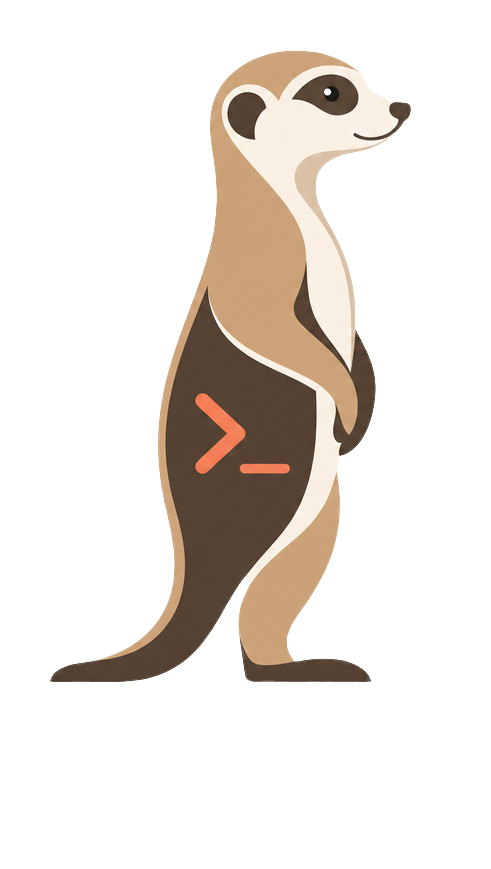
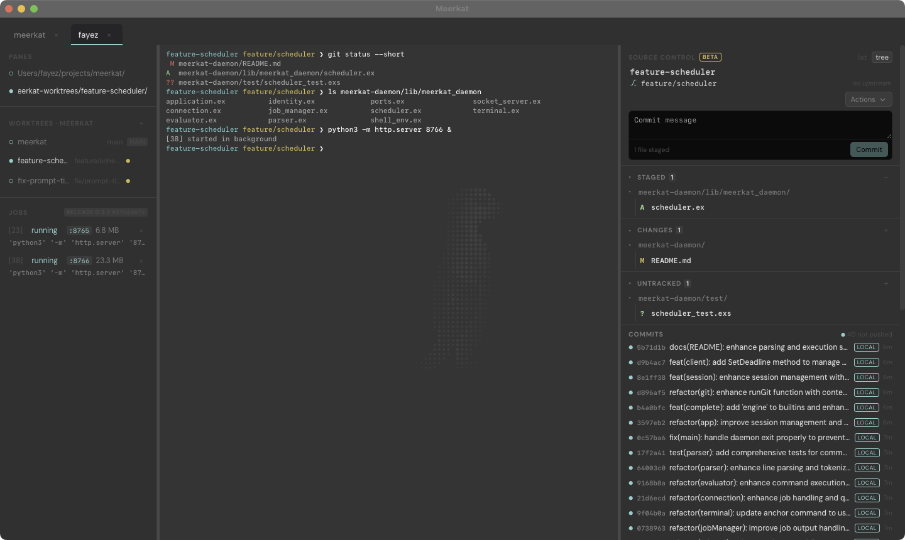

<p align="center">
  
</p>

# Meerkat

Meerkat is a custom shell with its execution engine split out into a
long-lived daemon, so the parsing/job-control/scheduling logic lives in one
place and every frontend — a plain CLI, a native GUI, whatever comes next —
is just a thin client that talks to it over a socket.

The core idea: your shell state (background jobs, working directory,
running commands) shouldn't die with your terminal window. It lives in the
daemon. Frontends connect, disconnect, and reconnect around it.

```
meerkat-client (CLI)  ─┐
                        ├─  Unix socket, line protocol  ─►  meerkat-daemon (BEAM/Elixir)
meerkat-app (GUI)     ─┘
```



*Meerkat.app with the sidebar (`Cmd+B`) and source control (`Cmd+G`) open: the
focused pane sits in a worktree the sidebar created, the jobs list shows two
dev servers and the ports they hold, and the panel on the right is that
worktree's own index and history.*

## Components

- **[`meerkat-daemon`](meerkat-daemon/)** — the engine. A BEAM (Elixir)
  application that owns parsing, pipeline execution, and real job control
  (`&`, `jobs`, `stop`/`bg`/`fg`, `kill`) via
  [erlexec](https://github.com/saleyn/erlexec). Durable scheduling
  (`every`/`at` blocks backed by Oban) is on the roadmap. It has no notion
  of "shell" beyond the protocol it speaks — anything that can dial its
  Unix socket and send newline-delimited text can drive it.

- **[`meerkat-client`](meerkat-client/)** — the minimal CLI frontend. A
  small Go binary that dials the daemon's socket (spawning it if nothing's
  listening), prints a prompt, and forwards each line you type. Starts
  instantly and stays that way regardless of how much heavier the daemon
  gets.

- **[`meerkat-app`](meerkat-app/)** — the GUI frontend. A real windowed
  terminal built with [Wails](https://wails.io) (Go) and
  [xterm.js](https://xtermjs.org), using the exact same connect-or-spawn
  logic and wire protocol as `meerkat-client` — just rendered in a window
  with proper terminal emulation instead of your existing terminal app.

Commands run in *your* environment, not the engine's. At startup the engine
asks your login shell (`$SHELL -ilc 'env -0'`) what it exports — so `.zshrc`
or `.bashrc` has run, `PATH` has `~/.local/bin` and whatever else you added,
and `TERM` is set — and gives that to every command. It matters because an
engine started by Meerkat.app opened from Spotlight would otherwise inherit
launchd's bare environment and stay that way for as long as it lives. Change
your rc file and run `meerkat-engine restart` to pick it up.

Both frontends are interchangeable views onto the same daemon: start a
background job from the CLI, then open the GUI and run `jobs` — it's the
same job table, because the state never lived in the client. Close the pane
your dev server is running in and it keeps serving: a job holding a listening
socket outlives the window that started it, and the GUI's sidebar lists it with
the port it's on, what it's costing in memory, and a button to kill it. On the
other side, `Cmd+G` opens source control (beta): staged, unstaged and untracked
changes with stage/discard buttons and inline diffs, recent commits with the
unpushed ones highlighted, stashes, and pull/push/sync. New worktrees can run a
setup script — yours from Preferences, or the repo's own
`.meerkat/worktree-setup.sh` — so a fresh checkout gets its `.env` and
dependencies without anyone remembering to.

## Installing a build

```
curl -fsSL https://meerkat.fayez-zouari.tn/install.sh | sh
```

That installs into `~/.meerkat` and leaves you with `meerkat` (the shell),
`meerkat-app` (the window), and `meerkat-engine` (start/stop/status) in
`~/.meerkat/bin`. See [`meerkat-site/README.md`](meerkat-site/README.md) for the
layout it writes and how to uninstall. macOS and Linux only. On Windows, run it
inside WSL2 and use the Linux build: building natively is not an option, because
the engine's job control is [erlexec](https://github.com/saleyn/erlexec), whose
port program is POSIX (`fork`/`execve`/`setsid`/`termios`) and has no Windows
target.

Running it again is how you upgrade. The installer compares the version on
offer with the one in `~/.meerkat/current`: the same version says so and stops,
a newer one is installed alongside and `current` is swapped over, and a running
engine from the old version is stopped so the next `meerkat` starts the new one.
Your settings survive — the app keeps themes, key bindings and appearance in its
own WebKit data store, keyed by bundle id rather than by install, and nothing in
`~/.meerkat` besides the program files is touched. It refuses to downgrade;
`sh -s -- --reinstall` overrides both that and the up-to-date check.

On Linux there is also a file: the page offers `meerkat-linux-amd64.tar.gz`,
and every tarball carries `install.sh`, so an unpacked release installs itself
with no network:

```
mkdir -p meerkat && tar -xzf ~/Downloads/meerkat-linux-amd64.tar.gz -C meerkat
./meerkat/install.sh
```

The `mkdir` is not optional — the archive is flat, and `tar -C` will not create
the directory it is pointed at.

On macOS the command is the only install the page offers, and that is a
Gatekeeper decision rather than a style one. A file a browser downloads is
quarantined, and macOS refuses to open a quarantined app unless it is signed
with an Apple Developer ID and notarized — which needs a paid developer account
this project does not have. There is no free way around that: an unsigned
`.dmg`, or a tarball a browser fetched and the Finder unpacked, both end in
"Meerkat is damaged and can't be opened". `curl | sh` and `tar` set no
quarantine flag, so they install the same `Meerkat.app` without the dialog. The
macOS tarballs are still published on every GitHub Release, complete bundle
inside, for anyone who wants to read before running:

```
mkdir -p meerkat && tar -xzf ~/Downloads/meerkat-darwin-arm64.tar.gz -C meerkat
./meerkat/install.sh
```

When there is a certificate, the `.dmg` comes back: set the signing secrets
listed under "Cutting a release", drop `--no-dmg` from the workflow, and add the
image to `DOWNLOAD_FILES` in `meerkat-site/src/data/install.js`.
[`scripts/package-dmg.sh`](scripts/package-dmg.sh) signs, notarizes and staples
already.

The page and the binaries are published separately. The page is a static deploy
of `meerkat-site`; the release tarballs are GitHub Release assets, because each
one has to be built on the platform it targets — the daemon ships a compiled OTP
release and erlexec builds a C++ port program, so nothing cross-compiles.
`install.sh` therefore downloads from the release rather than from whatever host
served it.

## Cutting a release

Run the `release` workflow from the Actions tab and pick what to increment:
patch, minor, major, or none. It reads `VERSION`, works out the next number,
commits the bump, tags it, opens the GitHub Release, then builds `darwin-arm64`,
`darwin-amd64` and `linux-amd64` on their own runners and uploads each tarball
with a `.sha256` beside it. A final job then checks the release against the
download page's own asset list, so a leg that silently failed to produce a file
the page offers fails the build instead of the visitor's download. Nothing to
remember and nothing to keep in sync — the version lives in `VERSION` and the tag
is derived from it.

Publishing a `.dmg` is the one thing that needs setting up outside the repo, and
the reason there isn't one yet. macOS refuses code that arrives with a browser's
quarantine flag unless it is signed and notarized, which the tarball sidesteps
only because `tar` does not set that flag. Set these repository secrets, drop the
`--no-dmg` from the workflow's `release.sh` call, and the macOS runners do the
rest. Left unset, `release.sh --publish` refuses to upload a disk image nobody
could open — `--allow-unsigned` overrides that, for a fork or a dry run:

| Secret | What it is |
| --- | --- |
| `MACOS_CERTIFICATE` | Developer ID Application `.p12`, base64-encoded |
| `MACOS_CERTIFICATE_PASSWORD` | the export password for that `.p12` |
| `MACOS_SIGN_IDENTITY` | e.g. `Developer ID Application: Name (TEAMID)` |
| `MACOS_NOTARY_APPLE_ID` | the Apple ID to notarize under |
| `MACOS_NOTARY_PASSWORD` | an app-specific password for it |
| `MACOS_NOTARY_TEAM_ID` | the team the certificate belongs to |

```
gh workflow run release -f bump=minor      # 0.1.0 -> 0.2.0
gh workflow run release -f version=1.0.0   # or name it outright
```

Pushing a `v*` tag by hand runs the same workflow, minus the bump; it checks the
tag against `VERSION` and refuses if they disagree.

```
git tag v0.1.0 && git push origin v0.1.0
```

`scripts/release.sh` is what those runners call, and it works the same by hand —
`--publish` uploads to the release for the current `VERSION`, and without it the
tarball just lands in `meerkat-site/public/downloads/latest/`, where the dev
server serves it for a real install over localhost:

```
./scripts/release.sh                 # --no-app skips the GUI, --no-dmg the image
cd meerkat-site && npm run dev
curl -fsSL http://localhost:5273/install.sh | sh
```

A local `.dmg` build is unsigned unless `MEERKAT_SIGN_IDENTITY` is exported —
fine for checking the layout, not for handing to anyone, and `--publish` will not
upload it. See [`scripts/package-dmg.sh`](scripts/package-dmg.sh) for the full set
of variables.

## Protocol

Newline-delimited plain text over a Unix domain socket
(`$MEERKAT_SOCK`, defaulting to `~/.meerkat/meerkat.sock`):

```
client -> daemon:  one line of shell input
daemon -> client:  "O:<text>"  one stdout line
                    "E:<text>"  one stderr line
                    "D:<cwd>"   sent on connect, and again if cwd changed
                    "H:<id>"    sent once after the first D: which engine this is
                    "X:<code>"  terminates this command's response
```

The `H` line is `version=… flavor=… instance=… pid=… node=… sock=…` — the
flavor is `release` for an installed engine and `dev` for a `mix run`, and the
instance is a random id minted at boot. It exists because two engines can be on
one machine: the installed one on `~/.meerkat/meerkat.sock` and a checkout's on
`~/.meerkat/dev.sock`, each pairing with the frontends built the same way. The
`engine` builtin prints the same thing; the GUI's sidebar shows it next to the
job table; `meerkat-cli --probe` asks a socket without starting anything, which
is what `meerkat-engine start` does before it will touch a socket file — an
engine never replaces another's live socket, it refuses and says whose it is.
Releases derive their node name from the socket path (`rel/env.sh.eex`), so
two installs can run at once too.

## Getting started

Run the daemon first (see [`meerkat-daemon/README.md`](meerkat-daemon/README.md)
for prerequisites — you'll need a C++ toolchain for erlexec):

```
cd meerkat-daemon
mix deps.get
mix run --no-halt
```

Then, in another terminal, either frontend will connect to it (and will
also spawn it automatically if it isn't already running):

```
cd meerkat-client
go run .
```

or, for the GUI (see [`meerkat-app/README.md`](meerkat-app/README.md) for
one-time Wails setup):

```
cd meerkat-app
wails dev
```

## Current limitations

- **The command line has no raw mode.** In the GUI every foreground command
  gets a real pty: `ssh`, `vim`, `htop`, `less`, `git diff` with colour, a
  password prompt, all behave as in any terminal, and Ctrl+C reaches the
  running program. `meerkat-cli` speaks the same protocol but never puts your
  terminal into raw mode, so full-screen programs and interactive prompts are
  GUI-only for now.
- **One pty per pane, shared by its commands** — deliberate (see the daemon's
  README: it is what lets `sudo` remember you), but it means a background job
  started with `&` has no terminal at all.

See each component's README for its own roadmap in more detail.
